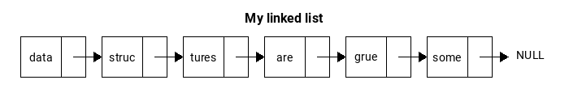
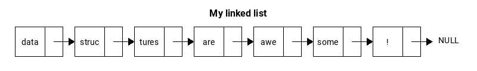

# dsviz

dsviz is a data structure visualization library written in Python. 

### Requirements
- python (3.4-3.6)
- python-pip

### Installation

Pypi installation

```sh
$ pip install dsviz
```

### Example Usage
```python
>>> from dsviz import SinglyLinkedList
>>> sll = SinglyLinkedList('My linked list', str)
>>> sll.append('struc')
>>> sll.append('tures')
>>> sll.append('are')
>>> sll.append('grue')
>>> sll.append('some')
>>> sll.prepend('data')
>>> sll.render()
```

```python
>>> sll.delete('grue')
>>> sll.insert(4, 'awe')
>>> sll.append('!')
>>> sll.render()
```


### Featured data structures
- ArrayStack
- AVLTree
- BinaryHeap
- BinarySearchTree
- DoubleEndedQueue
- DoublyLinkedList
- SingleEndedQueue
- SinglyLinkedList

### License
MIT
